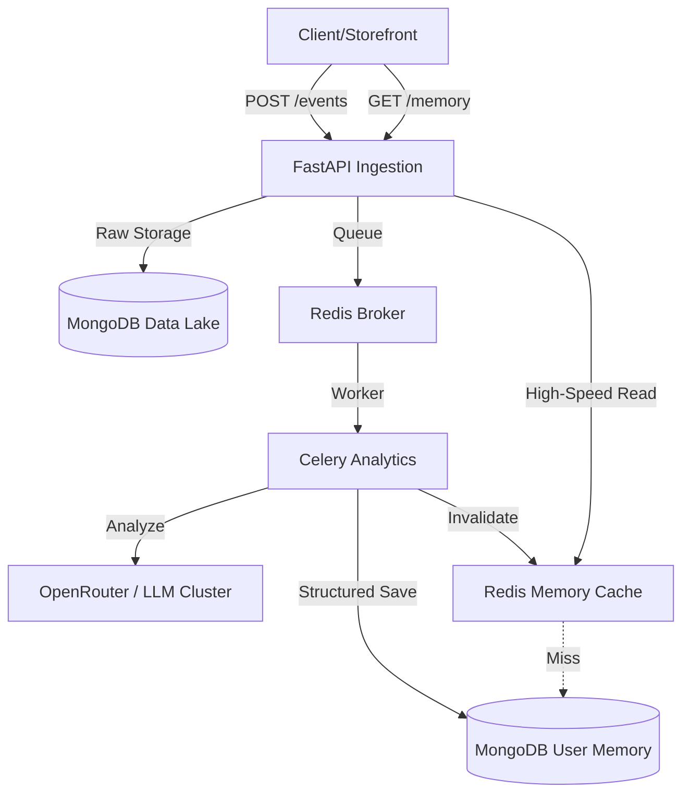

<div align="center">
  

  # Event Ingestion & User Memory Management System
  
  [](https://www.python.org/downloads/)
  [](https://fastapi.tiangolo.com/)
  [](https://www.mongodb.com/)
  [](https://redis.io/)
  [](LICENSE)

  **A high-performance, real-time user behavioral analysis engine designed for modern e-commerce.**
  *Transforming noisy, unstructured clickstream logs into multi-layered "Cognitive Memory" profiles for hyper-personalization at sub-10ms speeds.*
</div>

---

## Core Philosophy: The Memory System

Most systems filter data *before* storing it, losing valuable context forever. Our system uses a **Data Lake** architecture to preserve every "thought" and "action" of the user, allowing for retrospective analysis as AI models evolve.

1.  **Raw Ingestion**: Capture every raw event (logs, text, JSON) exactly as it arrives-immutable and audit-ready.
2.  **Asynchronous Brain**: Specialized LLM workers process the data lake in the background, extracting deep behavioral signals without slowing down the user experience.
3.  **Evolving Identity**: A 4-layer memory model that mirrors human-like cognition, providing a rich context for recommendation engines and personalized storefronts.

---

## Technical Architecture



### Infrastructure Stack

| Component | Technology | Rationale |
| :--- | :--- | :--- |
| **Gateway** | FastAPI | Async-native, sub-millisecond routing, and automatic OpenAPI documentation. |
| **Data Lake** | MongoDB | Immutable storage of unstructured raw events with flexible schema-on-read capability. |
| **Task Broker** | Redis | Low-latency message queuing for decoupling ingestion from heavy LLM processing. |
| **Analytics** | Celery | Mature, reliable distributed task execution with built-in retry logic and model fallback. |
| **Memory Store** | MongoDB | Optimized for deeply nested, document-based cognitive profiles (Persistent, Episodic, etc.). |
| **Cache Layer** | Redis | High-speed, cache-aside pattern ensuring personalization data is served in <10ms. |

---

## The 4-Layer Memory Model

The system organizes user data into four distinct cognitive layers, each serving a specific personalization goal:

- **Persistent**: Long-term, slow-changing traits (e.g., price sensitivity, favorite categories, location-based habits).
- **Episodic**: A chronological, bounded timeline of the last 100 specific actions (e.g., "Compared Laptop A vs. Laptop B 2 hours ago").
- **Semantic**: A set of inferred high-level interests and concept tags (e.g., "Gamer", "Fitness Enthusiast", "Early Adopter").
- **Contextual**: Immediate, session-specific intent (e.g., "Actively searching for a gift for a child's birthday").

---

## Quick Start & Demo

### 1. Boot the Stack
Ensure your `OPENROUTER_API_KEY` is present in the `.env` file, then run:
```bash
docker-compose up -d --build
```

### 2. Run the Behavioral Simulation
Mimic real-world user activity (browsing, comparisons, cart actions) using the automated walkthrough:
```bash
python scripts/simulate_events.py
```

### 3. The "Mic Drop" Verification (Sub-5ms Personalization)
1.  Open **`http://localhost:8000/docs`**.
2.  **Authorize** using your `API_KEY`.
3.  **GET /memory**:
    - **First Call**: Fetches from MongoDB (~80ms).
    - **Subsequent Calls**: Hits the **Redis Cache (~2ms)**.
4.  **Verify Intelligence**: Use `GET /events/raw/{user_id}` to see the "Raw Lake" and compare it with the structured intelligence in `GET /users/{user_id}/memory`.

---

## Deliverables & Security

- **Full Ingestion API**: Real-time storage of unstructured data.
- **Distributed Analytics**: Celery-powered LLM behavioral extraction.
- **High-Availability Cache**: Redis-backed personalization layer.
- **Security First**: API-Key validation, rate limiting, and payload size enforcement.
- **Verification Suite**: Built-in scripts for security auditing and simulation.

---

## License
Distributed under the [MIT License](LICENSE). 
