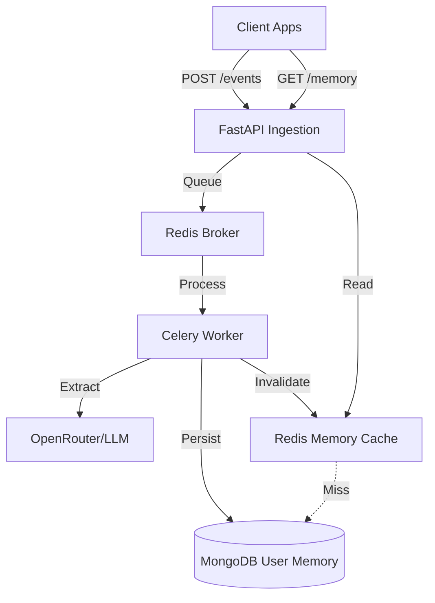

# Zave Memory System

A real-time, multi-layered user memory and behavioral analysis system for e-commerce, powered by LLMs and an asynchronous processing pipeline.

## 🚀 Overview

Zave ingest raw activity events (product views, cart additions, etc.) and transforms them into a structured behavioral profile. This profile is stored in a 4-layered memory model (Persistent, Episodic, Semantic, Contextual) to enable hyper-personalized user experiences.

### Key Features
- **Secure Ingestion**: API Key authenticated events with strict payload validation.
- **Async Pipeline**: FastAPI → Redis Queue → Celery Worker.
- **Behavioral Extraction**: High-parameter LLM extraction (via OpenRouter) with ranked fallback.
- **Multi-Layered Memory**: Atomic MongoDB updates for persistent preferences, episodic history, and semantic interests.
- **High Performance**: Redis-backed rate limiting and sub-10ms memory retrieval API.

## 🏗️ Architecture



## 🛠️ Tech Stack
- **Framework**: FastAPI (Python 3.11)
- **Task Queue**: Celery + Redis
- **Persistence**: MongoDB (Motor async driver)
- **Caching**: Redis
- **LLM**: OpenRouter (Llama 3.3, Nemotron, Qwen3)
- **Deployment**: Docker & Docker Compose

## 🚦 Getting Started

### Prerequisites
- Docker & Docker Compose
- OpenRouter API Key

### Setup
1. Clone the repository.
2. Create a `.env` file based on `.env.example`:
   ```bash
   API_KEY=your_internal_key
   OPENROUTER_API_KEY=your_openrouter_key
   ```
3. Boot the environment:
   ```bash
   docker-compose up -d --build
   ```

### Verification
Run the simulation script to verify the end-to-end pipeline:
```bash
python scripts/simulate_events.py
```

## 📜 Documentation
- [CHANGELOG.md](meta_docs/CHANGELOG.md): Detailed development history.
- [AI_RULES.md](meta_docs/AI_RULES.md): Governance for AI pairs.
- [implementation_plan.md](brain/implementation_plan.md): Technical roadmap.

## ⚖️ License
MIT
